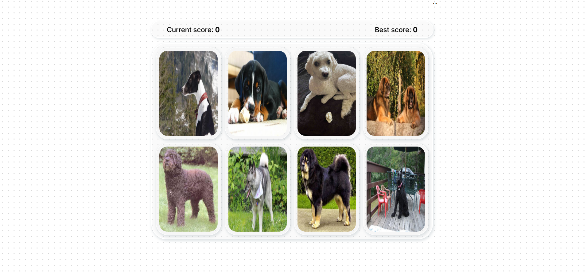
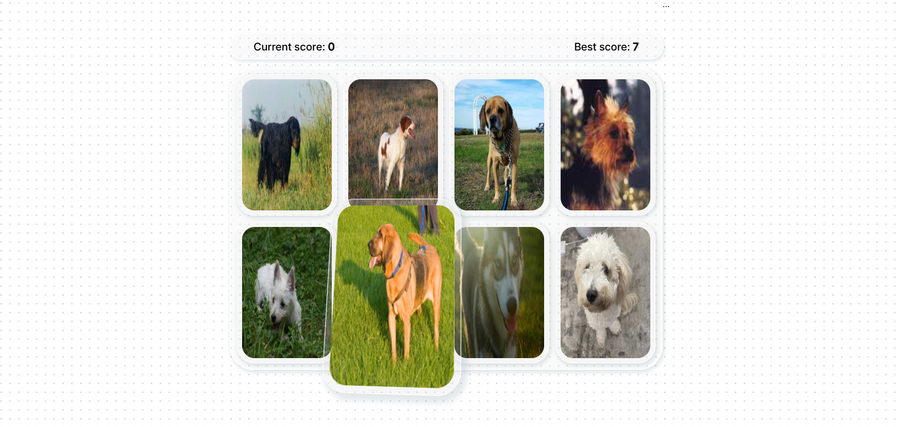

# **Memory Card Game**

Test your memory and enjoy a visually stunning experience with [this dog-themed card game](https://loremispum2k8-memory-card-game-lzxs.vercel.app/)! 
The game features 8 adorable dog cards with a sleek glassmorphism-style UI. Each card responds to hover with smooth movement, giving the interface a lively, interactive feel.

# **How to Play**:

1. Click a card you haven’t clicked yet → your current score increases.

2. Click a card you already clicked → you lose, and your current score resets, but your best score stays saved.

3. After every click, the cards shuffle, making it trickier to remember their positions.

- Built with React, HTML, CSS, and JavaScript, the game fetches dog images from an API, so each round features fresh, cute dogs. It also saves progress using Local Storage.
